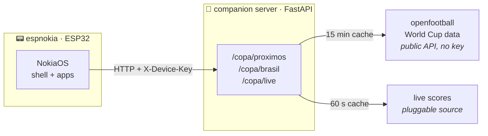

<p align="center">
  
</p>

<p align="center">
  
  
  
  
</p>

<p align="center">
  
  
  
</p>

<h3 align="center">
  📟 Meet the project&nbsp;&nbsp;·&nbsp;&nbsp;<a href="docs/INSTALL.md">🔧 Build your own</a>
</h3>

<p align="center">
  <a href="README.md">🇧🇷 Português</a>&nbsp;&nbsp;·&nbsp;&nbsp;🇬🇧 English
</p>

---

A Nokia 3310-style "phone" built from scratch: ESP32 + Nokia 5110 display
running a homemade **NokiaOS** — an app shell, recreated pixel fonts, the boot
animation with the hands meeting, factory ringtones in RTTTL and menus in 6
languages. Y2K looks, 2026 features: it follows the **2026 World Cup live**
and rings the very second a goal is scored. ⚽

The study theme underneath is **consuming APIs from embedded devices**: a
public keyless API on one side, a key-authenticated API of my own on the
other, and an ESP32 with 520 KB of RAM in the middle taking the hit.
[The API section](#-the-study-underneath-apis-with-and-without-keys) tells
the story.

<p align="center">
  
  
  
</p>

## ✨ What it does

| App | What's inside |
|---|---|
| ⏰ **Clock** | Big 3310-style time (DS3231 RTC), an **alarm** that survives reboots (NVS) and a countdown **timer** |
| 🏆 **World Cup 26** | Upcoming matches, Brazil matches and live matches. Mark a match and the device rings when it starts — and during the match, **"GOAL!" flashes on screen** when the score changes |
| 🌡️ **Weather** | Ambient temperature from the DS3231's built-in thermometer (0.25 °C resolution) |
| 🎵 **Tones** | 9 original Nokia factory ringtones transcribed to RTTTL (homemade parser) — browse to preview, OK sets the default tone |
| ⚙️ **Settings** | 3-level backlight, date/time, WiFi, piezo volume (3 levels), language and about |

Plus the details that make it feel like a real Nokia: a boot sequence faithful
to the Nokia 1100 (pixel art + startup chime), standby with the `:` blinking,
softkeys, key beeps and distinct system beeps for confirm, error and alert.

## 🏗️ How it works

Two pieces: the **device** (C++/Arduino firmware) and a **companion server**
(FastAPI) that chews through the data sources and serves lean JSON the ESP32
can parse without suffering.



During a live match the firmware refetches every 45 s, finds the match again
by its pair of teams (the list may change order) and compares the score — if
it went up, the alert rings and GOAL! flashes.

## 🔑 The study underneath: APIs with and without keys

The heart of the project is this complete data flow, from a public source on
the internet down to an 84×48 pixel display:

**Keyless API (openfootball).** The World Cup table comes from
[openfootball](https://github.com/openfootball/world-cup), a public JSON
dataset. No signup, no token — but an open API is not an invitation to abuse
it: the server caches the response for **15 minutes** (the table rarely
changes) and only revalidates when the TTL expires. The live-score source is
optional and pluggable (`LIVE_SOURCE_URL`), cached for 60 s; if it goes down,
the app degrades gracefully to the table — no live score, but nothing breaks.

**Keyed API (the companion server).** The ESP32 never talks to the sources
directly: it talks to the server, which requires an **`X-Device-Key`** header
on every `/copa/*` route (only `/health` stays open, for monitoring). Valid
keys live in the `DEVICE_KEYS` env as CSV — you can have several devices and
revoke one without touching the others. On the firmware side the key lives in
`espnokia_config.h`, which is **gitignored**: secrets never enter the
repository.

**Why a server in the middle?** The original openfootball JSON weighs
hundreds of KB — the ESP32 works with a 2 KB buffer. The server filters,
normalizes and answers ~1.2 KB for the 8 matches that matter. As a bonus, any
external-source credential lives on the server and **never touches the
firmware**: if a paid source ever takes its place, no device needs a reflash.

| | openfootball | companion server |
|---|---|---|
| Authentication | none | `X-Device-Key` |
| Consumed by | the server | the ESP32 |
| Response | hundreds of KB of JSON | ~1.2 KB of JSON |
| Source protection | 15 min TTL cache | per-device revocable keys |

## 🔌 Hardware

| | Component | Role |
|---|---|---|
|  | **ESP32 WROOM-32** DevKit, 30 pins | The brain: WiFi, 2 cores, and the whole NokiaOS |
|  | **Nokia 5110 display** (PCD8544) | 84×48 monochrome — the display from actual Nokias, over SPI |
|  | **DS3231 RTC** | Battery-backed accurate time + onboard thermometer, over I2C |
|  | **4 tactile buttons** | UP · DOWN · OK · C — full 3310-style navigation |
|  | **Passive buzzer** | RTTTL ringtones, beeps and the goal alert (volume via PWM duty) |
|  | **Breadboard + jumpers** | Solderless build — full pinout in [`docs/INSTALL.md`](docs/INSTALL.md) |

Planned for the next phases: an INMP441 I2S mic (voice conversations) and a
LiPo battery with voltage readout.

## 📶 WiFi without recompiling

Switching WiFi networks needs no USB cable and no reflash. The device brings
up a **config mode**: it becomes an access point (`espnokia-XXXX`) with a
**numeric password drawn on the spot** (hardware RNG, shown only on the
little screen) and a **captive portal** — connect and the configuration page
opens by itself. It **scans for nearby networks**, showing a padlock on
protected ones and signal-strength bars; tap a network to pick it, or type
the name in the manual field if yours is **hidden**:

<p align="center">
  
  &nbsp;&nbsp;
  
</p>

Your network password is encrypted in NVS with a key derived from the MAC
burned into the chip's eFuse: a flash dump from another device cannot decrypt
your network. 🔐

## 🧪 Quality

- **34 Unity tests** running straight on the PC (`pio test -e native`) — all
  the pure logic (shell, buttons, RTTTL, time formatting, World Cup parsing,
  i18n) is testable with no board on the desk
- **Server tested with pytest** — mocked data sources, auth and cache covered
- Clean layering: `drivers/` (hardware) · `lib/` (pure portable logic)
  · `apps/` (UI) — that's what lets the PC test what runs on the ESP32

## 🗂️ The repository

```
firmware/   NokiaOS in C++/Arduino (PlatformIO: esp32dev + native)
  lib/      pure testable logic: shell, btnlogic, rtttl, i18n, copamodel...
  src/      drivers, apps, sound, alarm, networking (wifi/http/ntp/provisioning)
server/     FastAPI companion: /copa/* with X-Device-Key, caching and a Dockerfile
docs/       install guide, README assets
tools/      pixel-art utilities (grid → XBM)
```

---

<p align="center">
  Want one on your desk? → <a href="docs/INSTALL.md"><b>🔧 Build & install guide</b></a> <i>(in Portuguese)</i>
</p>
