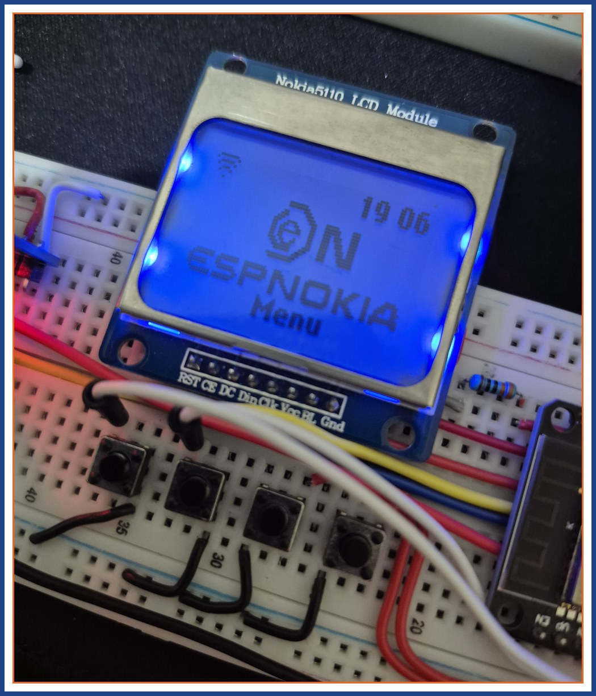
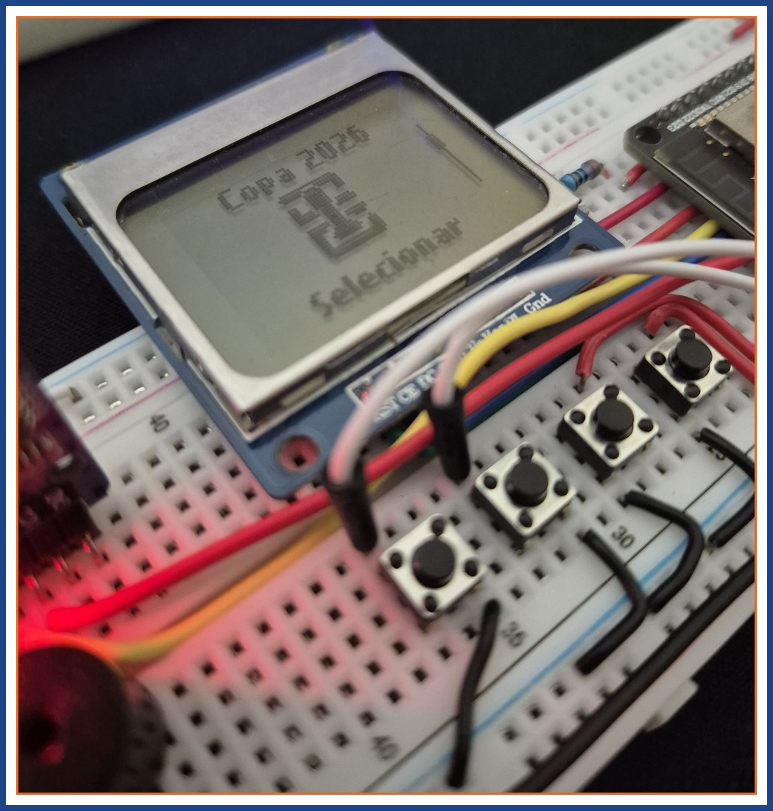
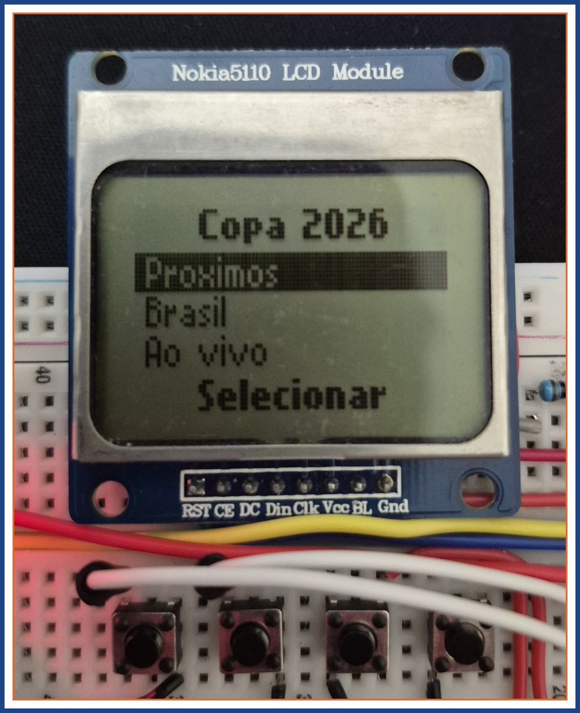
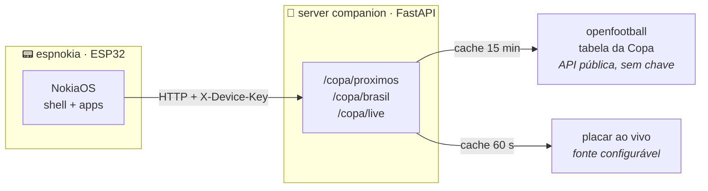

<p align="center">
  
</p>

<p align="center">
  
  
  
  
</p>

<p align="center">
  
  
  
</p>

<h3 align="center">
  📟 Conhecer o projeto&nbsp;&nbsp;·&nbsp;&nbsp;<a href="docs/INSTALL.md">🔧 Montar o seu</a>
</h3>

<p align="center">
  🇧🇷 Português&nbsp;&nbsp;·&nbsp;&nbsp;<a href="README.en.md">🇬🇧 English</a>
</p>

---

Um "celular" estilo Nokia 3310 construído do zero: ESP32 + display Nokia 5110
rodando um **NokiaOS próprio** — shell de apps, fontes pixel recriadas, boot com
as mãozinhas se encontrando, toques de fábrica em RTTTL e menus em 6 idiomas.
Estética de 2000, recursos de 2026: ele acompanha a **Copa 2026 ao vivo** e
avisa o gol no segundo em que sai. ⚽

O tema de estudo por trás é **consumo de APIs em dispositivos embarcados**:
uma API pública sem chave de um lado, uma API própria autenticada por chave de
device do outro, e um ESP32 com 520 KB de RAM no meio aguentando o tranco.
[A seção de APIs](#-o-estudo-por-trás-apis-com-chave-e-sem-chave) conta como.

<p align="center">
  
  
  
</p>

## ✨ O que ele faz

| App | O que tem dentro |
|---|---|
| ⏰ **Relógio** | Hora grande estilo 3310 (RTC DS3231), **alarme** que sobrevive a reboot (NVS) e **timer** regressivo |
| 🏆 **Copa 2026** | Próximos jogos, jogos do Brasil e jogos ao vivo. Marque um jogo e o aparelho toca quando começar — e durante o jogo, **"GOL!" pisca na tela** quando o placar muda |
| 🌡️ **Clima** | Temperatura ambiente pelo termômetro embutido do DS3231 (resolução 0.25 °C) |
| 🎵 **Toques** | 9 toques originais de fábrica da Nokia transcritos em RTTTL (parser próprio) — navegue para ouvir o preview, OK define o toque padrão |
| ⚙️ **Config.** | Backlight em 3 níveis, data/hora, WiFi, volume do piezo (3 níveis via duty PWM), idioma e sobre |

E os detalhes que fazem parecer um Nokia de verdade: boot fiel ao Nokia 1100
(pixel art + startup chime), standby com hora piscando o `:`, softkeys,
beep de tecla e bips de sistema distintos para confirmação, erro e alerta.

## 🏗️ Como funciona

Duas peças: o **aparelho** (firmware C++/Arduino) e um **server companion**
(FastAPI) que mastiga as fontes de dados e entrega JSON enxuto que o ESP32
consegue parsear sem sofrer.



Durante um jogo ao vivo, o firmware refaz a busca a cada 45 s, reencontra o
jogo pelo par de seleções (a lista pode mudar de ordem) e compara o placar —
subiu, toca o alerta e pisca o GOL!.

## 🔑 O estudo por trás: APIs com chave e sem chave

O recheio do projeto é este fluxo completo de dados, de uma fonte pública na
internet até um display de 84×48 pixels:

**API sem chave (openfootball).** A tabela da Copa vem do
[openfootball](https://github.com/openfootball/world-cup), um dataset público
em JSON. Não pede cadastro nem token — mas API aberta não é convite pra abuso:
o server guarda a resposta por **15 minutos** (a tabela muda pouco) e só
revalida quando o TTL vence. A fonte de placar ao vivo é opcional e plugável
(`LIVE_SOURCE_URL`), com cache de 60 s; se ela cair, o app degrada com
elegância pra tabela — sem placar ao vivo, mas sem quebrar.

**API com chave (o server companion).** O ESP32 não fala com as fontes
diretamente: ele fala com o server, que exige um header **`X-Device-Key`** em
todas as rotas `/copa/*` (só o `/health` fica aberto, pra monitoramento). As
chaves válidas ficam na env `DEVICE_KEYS` em CSV — dá pra ter vários aparelhos
e revogar um sem afetar os outros. No firmware, a chave mora em
`espnokia_config.h`, que é **gitignored**: segredo não entra em repositório.

**Por que um server no meio?** O JSON original do openfootball tem centenas de
KB — o ESP32 trabalha com um buffer de 2 KB. O server filtra, normaliza e
responde ~1.2 KB pros 8 jogos que interessam. De quebra, qualquer credencial
de fonte externa vive no server e **nunca toca o firmware**: se um dia uma
fonte paga entrar no lugar, nenhum aparelho precisa de reflash.

| | openfootball | server companion |
|---|---|---|
| Autenticação | nenhuma | `X-Device-Key` |
| Quem consome | o server | o ESP32 |
| Resposta | JSON de centenas de KB | JSON de ~1.2 KB |
| Proteção da fonte | cache TTL 15 min | chaves revogáveis por device |

## 🔌 Hardware

| | Componente | Papel |
|---|---|---|
|  | **ESP32 WROOM-32** DevKit 30 pinos | Cérebro: WiFi, 2 cores, e o NokiaOS inteiro |
|  | **Display Nokia 5110** (PCD8544) | 84×48 monocromático — o display dos Nokia de verdade, via SPI |
|  | **RTC DS3231** | Hora precisa com bateria + termômetro de bordo, via I2C |
|  | **4 botões táteis** | UP · DOWN · OK · C — navegação completa estilo 3310 |
|  | **Buzzer passivo** | Toques RTTTL, beeps e o alerta de gol (volume por duty PWM) |
|  | **Protoboard + jumpers** | Montagem sem solda — pinagem completa em [`docs/INSTALL.md`](docs/INSTALL.md) |

Planejado para as próximas fases: mic I2S INMP441 (conversa por voz) e bateria
LiPo com leitura de tensão.

## 📶 WiFi sem recompilar

Trocar de rede WiFi não pede cabo USB nem reflash. O aparelho sobe um **modo
config**: vira um access point (`espnokia-XXXX`) com **senha numérica
sorteada na hora** (hardware RNG, exibida só na telinha) e um **captive
portal** — conectou, a página de configuração abre sozinha. Ela **busca as
redes próximas** com cadeado nas protegidas e barras de intensidade de sinal;
toque numa rede pra escolher, ou digite o nome no campo manual se a sua for
**oculta**:

<p align="center">
  
  &nbsp;&nbsp;
  
</p>

A senha da sua rede é cifrada na NVS com chave derivada do MAC gravado em
eFuse do próprio chip: um dump da flash de outro aparelho não decifra a sua
rede. 🔐

## 🧪 Qualidade

- **34 testes Unity** rodando direto no PC (`pio test -e native`) — toda a
  lógica pura (shell, botões, RTTTL, formatação de hora, parse da Copa, i18n)
  testa sem placa nenhuma na mesa
- **Server com pytest** — fontes de dados mockadas, auth e cache cobertos
- Camadas bem separadas: `drivers/` (hardware) · `lib/` (lógica pura portável)
  · `apps/` (UI) — é o que permite testar no PC o que roda no ESP32

## 🗂️ O repositório

```
firmware/   NokiaOS em C++/Arduino (PlatformIO: esp32dev + native)
  lib/      lógica pura testável: shell, btnlogic, rtttl, i18n, copamodel...
  src/      drivers, apps, som, alarme, rede (wifi/http/ntp/provisionamento)
server/     companion FastAPI: /copa/* com X-Device-Key, cache e Dockerfile
docs/       instalação, assets do README
tools/      utilitários de pixel art (grid → XBM)
```

---

<p align="center">
  Quer um na sua mesa? → <a href="docs/INSTALL.md"><b>🔧 Guia de montagem e instalação</b></a>
</p>
