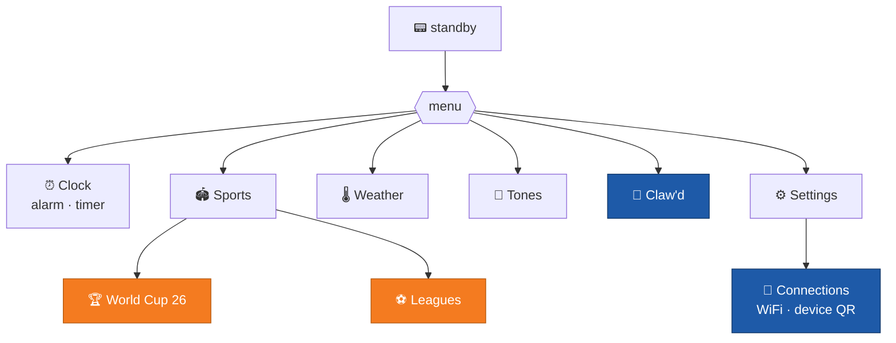
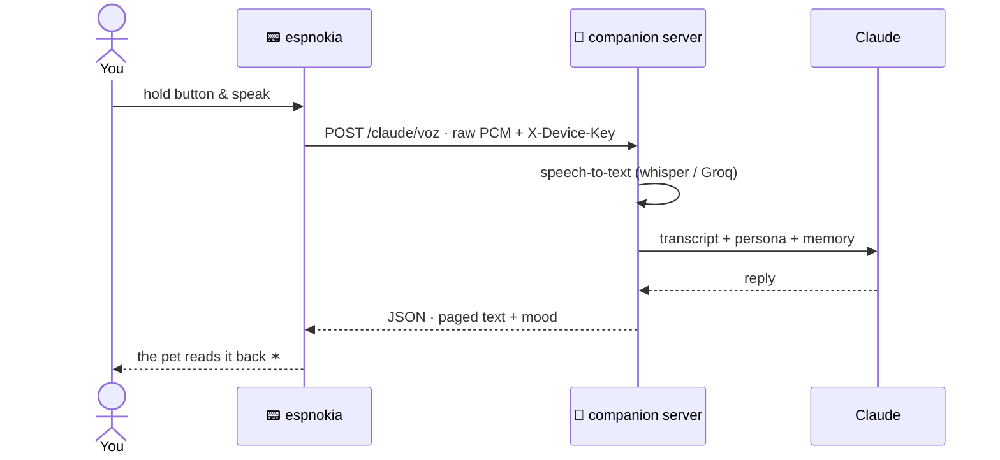

<p align="center">
  
</p>

<p align="center">
  
</p>

<p align="center">
  
  
  
  
</p>

<p align="center">
  <a href="#-clawd--talk-to-claude-from-a-nokia">
    
  </a>
  &nbsp;
</p>

<p align="center">
  
  
  
  
</p>

<h3 align="center">
  📟 Meet the project&nbsp;&nbsp;·&nbsp;&nbsp;<a href="docs/INSTALL.md">🔧 Build your own</a>
</h3>

<p align="center">
  🇬🇧 English&nbsp;&nbsp;·&nbsp;&nbsp;<a href="README.pt-br.md">🇧🇷 Português</a>
</p>

---

A Nokia 3310-style "phone" built from scratch: an **ESP32 + Nokia 5110 display**
running a homemade **NokiaOS** — an app shell, the Nokia 3310 pixel fonts, that
boot animation up there with the little hands meeting, factory ringtones in
RTTTL and menus in 9 languages.

**Y2K looks, 2026 features.** It follows the **2026 World Cup live** and rings
the very second a goal is scored ⚽, tracks **club leagues** with adaptive
standings tables, and — the headline act — it lets you **hold a button and talk
to Claude** 🐾: a pixel-art pet that listens, thinks and answers right there on
the monochrome screen.

### ▶️ See it move

<table align="center">
<tr>
<td align="center" width="50%">
  <br>
  <b>🐾 Claw'd</b> — hold, speak, let Claude answer
</td>
<td align="center" width="50%">
  <br>
  <b>🏆 World Cup 26</b> — live on a 84×48 screen
</td>
</tr>
</table>

---

## 📑 Contents

**The showcase**
- [The apps](#️-the-apps) · [Everyday](#️-everyday) · [World Cup 26](#-world-cup-26) · [Leagues](#-leagues) · [Claw'd](#-clawd--talk-to-claude-from-a-nokia) · [Pairing & dashboard](#-pairing--the-dashboard)

**Under the hood**
- [APIs with & without keys](#-the-study-underneath-apis-with-and-without-keys) · [System architecture](#️-system-architecture) · [WiFi without recompiling](#-wifi-without-recompiling)
- [Behind the art](#-behind-the-art) · [Hardware](#-hardware) · [Quality](#-quality) · [Make your own app](#-make-your-own-app)
- [Credits](#-credits--attributions) · [Trademarks](#️-trademarks--authorship)

---

## 🗺️ The apps

Everything lives behind a Nokia-faithful launcher: softkeys, key beeps, a
blinking `:` on standby and distinct system tones for confirm, error and alert.



---

# 🗂️ Showcase

## 🛠️ Everyday

The bread and butter — a real 3310-style clock with an **alarm** that survives
reboots and a **timer**; ambient **temperature** from the DS3231's onboard
thermometer; **9 original Nokia ringtones** transcribed to RTTTL (browse to
preview, OK to set); and **Connections**, where WiFi and the device QR live.

<p align="center">
  
  
  
  
</p>

---

## 🏆 World Cup 26


Upcoming matches, Brazil's fixtures, the live board and the group tables. Mark a
match and the phone **rings at kickoff**; while it's running, the score updates
by itself and **"GOAL!" flashes on screen** the instant it changes — with the
scorer's name when the source has it.

<p align="center">
  
  
  
  
</p>

<p align="center"><b>Flow</b> &nbsp;·&nbsp; menu → live list → goal alert</p>
<p align="center">
  
</p>

---

## ⚽ Leagues

The Sports category opens into club football too: Champions League, Libertadores
and friends. The standings view **adapts to the competition** — a numbered table
for round-robin leagues, navigable groups for cups — and the menu **captures
whatever is currently running**, showing the season in play.

<p align="center">
  
  
  
  
</p>

<p align="center"><b>Flow</b> &nbsp;·&nbsp; leagues → league menu → games / table</p>
<p align="center">
  
</p>

---

## 🐾 Claw'd — talk to Claude from a Nokia


Hold the button, **speak**, let go. The mic samples your voice, the companion
server transcribes it, **Claude answers**, and a pixel-art pet reads the reply
back page by page on the 84×48 screen — pulsing the six-pointed star while it
thinks. Every exchange is kept in a **conversation log**, and an accumulating
**memory** lets the pet remember you across reboots.

<p align="center">
  
  
</p>

> The pet's mood reacts to how you treat it, the reply is cut to exactly the
> byte budget the screen can page, and the spinner is the very six-pointed star
> from Claude Code, redrawn pixel by pixel. ✶

<details open>
<summary><b>Bring your own keys</b> — Claw'd is yours to run</summary>

There's no hosted backend, no account, nothing phoning home. Stand up the
companion server anywhere that runs a container, drop in your own keys, and
point the device at it:

```bash
# server/.env  (never committed)
ANTHROPIC_API_KEY=sk-ant-...        # your Claude key — the only must-have
DEVICE_KEYS=*                       # capability mode: accept any strong device key
GROQ_API_KEY=gsk_...                # optional: cloud STT instead of local whisper
```

```bash
cd server
docker build -t espnokia .
docker run -p 8000:8000 --env-file .env espnokia
```

Then open **Settings → Connections** on the phone and type your server's URL —
no reflash, no recompile. Speech-to-text runs **locally** (faster-whisper) by
default, or flip to **Groq** from the dashboard if you'd rather offload it.

</details>

---

## 📲 Pairing &amp; the dashboard

<table align="center"><tr>
<td width="150" align="center"></td>
<td>

The device **rolls its own key** at first boot (hardware RNG → NVS) and shows a
**QR code** under *Connections → Device QR*. Scan it and the **dashboard opens
already logged in** — the key travels in the URL fragment, so the browser that
paired is the one that gets in. The key *is* the capability: no users, no
passwords, data isolated per device by a salted hash.

</td>
</tr></table>

The dashboard is an **installable PWA — "EspNokia Dash"** — mobile-first, in 9
languages, sharing the phone's palette and logo. From it you read the pet's
**memory** and recent **conversations** (or wipe them), pick the **persona**
(Cuddly, Sarcastic, Hyped, Poet, Tough, Wise — the prompt stays in the code),
choose the **STT engine**, set the **reply length** and drop in your **API keys**.

<p align="center">
  
</p>

> Set a key from the dashboard and it lives as long as the server runs; for a
> permanent key, use the `ANTHROPIC_API_KEY` env.

<br>

---

<h1 align="center">⚙️ Under the hood</h1>

## 🔑 The study underneath: APIs with and without keys

The backbone of the project is one complete data path — from a public source on
the open internet down to an 84×48 pixel display — and the two ways a device
earns access along the way.

**Keyless API (openfootball).** The World Cup data comes from
[openfootball](https://github.com/openfootball/world-cup), a public JSON
dataset: no signup, no token. But an open API is not an invitation to abuse it —
the server caches each response for **15 minutes** and only revalidates when the
TTL expires. The live-score source is optional and **pluggable**; if it drops,
the app degrades gracefully to the table instead of breaking.

**Keyed API (the companion server).** The ESP32 never talks to the sources
directly — it talks to *your* server, which requires an **`X-Device-Key`** on
every route (only `/health` stays open). In **capability mode** (`DEVICE_KEYS=*`)
any sufficiently strong key is accepted and its data is isolated by hash, so a
device can pair itself without a central registry. On the firmware side the key
lives in NVS (or `espnokia_config.h`, which is **gitignored**) — secrets never
enter the repo.

| | public sources | companion server |
|---|---|---|
| Authentication | none | `X-Device-Key` (capability) |
| Consumed by | the server | the ESP32 |
| Response | hundreds of KB of JSON | lean JSON the chip can parse |
| What it protects | TTL cache, graceful fallback | per-device isolation, your keys |

## 🏛️ System architecture

Two pieces: the **device** (C++/Arduino firmware) and a **companion server**
(FastAPI) that chews through the data sources and serves lean JSON the ESP32 can
parse without suffering. The chip never touches an external source directly —
the server is the membrane between a 2 KB buffer and the open internet.

<p align="center">
  
</p>

When you talk to Claw'd, this is the round trip — voice in, paged text out:



## 📶 WiFi without recompiling

Switching networks needs no USB cable and no reflash. The device brings up a
**config mode**: it becomes an access point (`espnokia-XXXX`) with a **numeric
password drawn on the spot** (hardware RNG, shown only on the little screen) and
a **captive portal** that opens by itself. It **scans nearby networks** — padlock
on the protected ones, signal bars — or you type a **hidden** SSID by hand. The
same page is where you set the **server URL**.

<p align="center">
  
  &nbsp;&nbsp;
  
</p>

Your WiFi password is encrypted in NVS with a key derived from the MAC burned
into the chip's eFuse: a flash dump from another device cannot decrypt it. 🔐

## 🎨 Behind the art

Every glyph on that screen was a decision. The **Nokia 3310 pixel fonts** are the
real ones, redrawn pixel-by-pixel from the screen by
[Premysl Janouch](https://git.janouch.name/p/nokia-3310-fonts) and converted to
the embedded format with u8g2's `bdfconv` — I extended them with the Latin-1
accents the 9 system languages need. The boot up top is the Nokia 1100's hands
meeting, frame by frame; the World Cup trophy, the football, the menu icons and
the pet are **bitmaps authored in a tiny grid DSL** and compiled to XBM by a
[home-grown tool](tools/) — so the art lives in version control as text, not
binary blobs.

The hardest piece was the **thinking spinner**: getting Claude Code's
six-pointed star to read correctly at a handful of pixels took several passes —
rendering it large and downscaling lost the points, drawing it small distorted
them, until a symmetric hand-placed sprite finally pulsed right. The orange
six-pointed star below is the maker's mark that came out of it.

<p align="center">
  
</p>

<p align="center"><b>Whole-device navigation</b></p>
<p align="center">
  
</p>

## 🔌 Hardware

| | Component | Role |
|---|---|---|
|  | **ESP32 WROOM-32** DevKit, 30 pins | The brain: WiFi, 2 cores, the whole NokiaOS |
|  | **Nokia 5110 display** (PCD8544) | 84×48 monochrome — the panel from real Nokias, over SPI |
|  | **DS3231 RTC** | Battery-backed time + onboard thermometer, over I2C |
|  | **4 tactile buttons** | UP · DOWN · OK · C — full 3310-style navigation |
|  | **Passive buzzer** | RTTTL ringtones, beeps and the goal alert (volume via PWM) |
| 🎤 | **INMP441 I2S mic** | Picks up your voice for Claw'd |
|  | **Breadboard + jumpers** | Solderless build — full pinout in [`docs/INSTALL.md`](docs/INSTALL.md) |

<p align="center">
  
</p>

## 🧪 Quality

- **82 Unity tests** running straight on the PC (`pio test -e native`) — all the
  pure logic (shell, buttons, RTTTL, time formatting, World Cup &amp; football
  parsing, the Claw'd model, i18n) is testable with no board on the desk.
- **157 pytest tests** on the server — mocked sources, auth, cache, personas,
  memory and the dashboard endpoints.
- Clean layering: `drivers/` (hardware) · `lib/` (pure portable logic) ·
  `apps/` (UI). That separation is what lets the PC test what runs on the ESP32.

And it all fits with room to spare — the whole NokiaOS, the apps, WiFi/TLS and
the voice pipeline land at **a third of the flash** and a quarter of the RAM:

<p align="center">
  
</p>

```
firmware/   NokiaOS in C++/Arduino (PlatformIO: esp32dev + native)
  lib/      pure testable logic: shell, btnlogic, rtttl, i18n, copamodel, claudemodel...
  src/      drivers, apps, sound, alarm, networking (wifi/http/ntp/provisioning), conn
server/     FastAPI companion: /copa /futebol /claude /admin + the dashboard PWA
docs/       install guide, README assets
tools/      pixel-art utilities (grid → XBM)
```

## 🧩 Make your own app

NokiaOS is an app shell — a new screen is a small struct of callbacks plus one
line in the launcher. There's a **step-by-step pointer** for it (a suggestion,
not a rulebook), with a minimal app you can copy:

<p align="center">
  <b><a href="docs/MAKE_AN_APP.md">🧩 Make your own app →</a></b>
</p>

---

## 🙏 Credits &amp; attributions

This project stands on open work. Every external source, library and reference
it leans on, with thanks:

**Data sources**
- [**openfootball**](https://github.com/openfootball/world-cup) — public-domain World Cup dataset (fixtures &amp; tables).
- **ESPN** — live scores and league data via unofficial public endpoints. Scores and team data © ESPN / The Walt Disney Company.

**AI &amp; speech**
- [**Anthropic Claude**](https://www.anthropic.com/) — the brain behind Claw'd, via the Anthropic API.
- [**faster-whisper**](https://github.com/SYSTRAN/faster-whisper) — local speech-to-text (CTranslate2 / OpenAI Whisper).
- [**Groq**](https://groq.com/) — optional cloud speech-to-text.

**Fonts &amp; art reference**
- [**nokia-3310-fonts**](https://git.janouch.name/p/nokia-3310-fonts) by **Premysl Janouch** — the Nokia 3310 pixel fonts, the heart of the UI's look.
- Nokia 1100 boot sequence &amp; factory ringtones — reproduced from reference as a homage.

**Firmware libraries**
- [**U8g2**](https://github.com/olikraus/u8g2) (olikraus) · [**ArduinoJson**](https://arduinojson.org/) (bblanchon) · [**QRCode**](https://github.com/ricmoo/QRCode) (ricmoo).

**Server libraries**
- [**FastAPI**](https://fastapi.tiangolo.com/) · [**Uvicorn**](https://www.uvicorn.org/) · [**httpx**](https://www.python-httpx.org/) · the [**Anthropic SDK**](https://github.com/anthropics/anthropic-sdk-python).

**Logos** — the Claude symbol and the 2026 FIFA World Cup emblem shown above are reproduced from [Wikimedia Commons](https://commons.wikimedia.org/) for reference only.

---

## ⚖️ Trademarks &amp; authorship

**Nokia** and the Nokia phone designs are trademarks of **Nokia Corporation**.
**Claude** and **Anthropic** are trademarks of **Anthropic, PBC**. The **FIFA
World Cup** name and emblem are trademarks of **FIFA**. **Groq**, **ESPN** and
any other names belong to their respective owners. This is an independent,
**non-commercial fan &amp; educational project** — a homage — and is **not
affiliated with, endorsed by or sponsored by** any of them. All referenced
brands, logos and data remain the property of their respective owners.

Original code, firmware, pixel art and assets © 2026 **Bernardo Melo**.
Third-party components keep their own licenses (see each project above).

---

<p align="center">
  Want one on your desk? → <a href="docs/INSTALL.md"><b>🔧 Build &amp; install guide</b></a>
  &nbsp;·&nbsp;  made by <b>Bernardo Melo</b>
</p>
