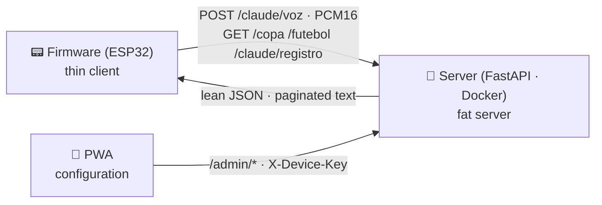

<p align="center">
  
</p>

<p align="center">
  
  
  
  
</p>

<p align="center">
  
  
  
  
</p>

<p align="center">
  🇬🇧 English&nbsp;&nbsp;·&nbsp;&nbsp;<a href="README.pt-br.md">🇧🇷 Português</a>&nbsp;&nbsp;·&nbsp;&nbsp;<a href="docs/INSTALL.md">🔧 Build yours</a>&nbsp;&nbsp;·&nbsp;&nbsp;<a href="docs/ARQUITETURA.md">🏛️ Architecture</a>&nbsp;&nbsp;·&nbsp;&nbsp;<a href="docs/MAKE_AN_APP.md">🧩 Make an app</a>
</p>

---

<p align="center"><b>A Nokia 3310 that talks to Claude — firmware, printed case, backend and PWA, all built by me.</b></p>

I built this handheld from scratch to fold everything I wanted to show into one project: **embedded firmware** on an ESP32, a **case I designed and printed**, an **AI-powered FastAPI backend** and a **configuration PWA**. It's my end-to-end portfolio — from the pixel on the 84×48 screen to the container on deploy. Year-2000 looks, 2026 features.

<!-- PHOTO — uncomment after adding docs/assets/foto-espnokia-01.jpg:
<p align="center">
  
</p>
-->

<p align="center">
  
</p>

---

## ✨ What it does

- 🐾 **Claw'd — talk to Claude.** Hold the button, speak, release: the mic captures, the server transcribes, **Claude answers**, and a pixel-art critter reads the reply on the little screen. Every exchange becomes a **log**, and a rolling **memory** lets the pet remember you across reboots.
- 🏆 **World Cup 2026, live.** Upcoming matches, Brazil's games, a live panel and group tables. Flag a match and the device **rings when it kicks off**; the score updates on its own and **"GOAL!" flashes on screen** the instant it changes.
- ⚽ **Club leagues.** Champions League, Libertadores and friends, with a standings table that **adapts to the competition** (numbered league table / navigable groups).
- ⏰ **3310-style daily life.** A clock with an **alarm that survives reboots** and a timer, ambient temperature from the DS3231, and **9 original Nokia ringtones** in RTTTL.
- 🐍 **Snake II.** The classic, with its own engine tested on the PC.
- 📶 **WiFi with no recompile.** The device becomes an access point with a captive portal and a freshly-drawn password — switch network and server URL with no cable and no reflash.
- 🌍 **9 languages** across the whole system; **99 native tests** of pure logic + **157 on the server**.

<table align="center">
<tr>
<td align="center" width="50%">
  <br>
  <b>🐾 Claw'd</b> — hold, speak, Claude answers
</td>
<td align="center" width="50%">
  <br>
  <b>🏆 WC 26</b> — live on an 84×48 screen
</td>
</tr>
</table>

<!-- PHOTO — uncomment after adding docs/assets/foto-espnokia-02.jpg:
<p align="center">
  
</p>
-->

**Configuration via the PWA.** An installable web panel (the "EspNokia Dash") **configures the device**: pair/discover by QR, see the **online status**, pick **Claude's personality**, the transcription engine, and drop in the **AI key** — with no config screen on the Nokia itself.

---

## 🔍 How it works

It's **three pieces** that talk over an authenticated API (`X-Device-Key`). The ESP32 is a plain chip, **no PSRAM** and with little RAM/flash — so it stores no history and transcribes nothing: it keeps only fixed buffers, a state machine, and **paginates** what it needs. All the durable state (the pet's memory, transcription, Claude calls) lives on the **server**, which **summarizes** old conversations so the context never grows without bound.

> **The core idea:** a *thin client* on the ESP32 (fixed, byte-capped buffers) + a *fat server* that holds and summarizes the history. That's how the firmware fits in **~⅓ of the flash and ¼ of the RAM** (flash 36.1% / RAM 25.6%).



Architecture and technical decisions → **[docs/ARQUITETURA.md](docs/ARQUITETURA.md)** (in Portuguese for now)

---

## 🔌 Hardware

| | Component | Role |
|---|---|---|
|  | **ESP32 WROOM-32** DevKit, 30 pins | Brain: WiFi, 2 cores, the whole NokiaOS |
|  | **Nokia 5110 display** (PCD8544) | 84×48 monochrome — the real Nokia panel, over SPI |
|  | **DS3231 RTC** | Battery-backed time + on-board thermometer, over I2C |
|  | **4 tactile buttons** | UP · DOWN · OK · C — full 3310-style navigation |
|  | **Passive buzzer** | RTTTL ringtones, beeps and the goal alert (volume via PWM) |
| 🎤 | **I2S mic INMP441** | Captures your voice for Claw'd |
|  | **Breadboard + jumpers** | Solderless build — full pinout in [`docs/INSTALL.md`](docs/INSTALL.md) |

---

## 🚀 Run / build

```bash
# Firmware (PlatformIO) — from firmware/
cd firmware
pio run  -e esp32dev     # builds and flashes the ESP32
pio test -e native       # 99 pure-logic tests, run on the PC

# Server (FastAPI) — from server/
cd server
docker build -t espnokia .
docker run -p 8000:8000 --env-file .env espnokia   # ANTHROPIC_API_KEY is the only required one
```

**Deploy:** the plain `Dockerfile` runs on any container host — it's published on **Railway**. Then just open *Settings → Connections* on the device and point it at the server URL (no reflash). Full build guide in **[docs/INSTALL.md](docs/INSTALL.md)**.

---

## 🙏 Credits & attributions

This project stands on open work, with thanks:

- **Data** — [openfootball](https://github.com/openfootball/world-cup) (public-domain World Cup dataset) · **ESPN** (live scores and leagues via public endpoints; data © ESPN / The Walt Disney Company).
- **AI & voice** — [Anthropic Claude](https://www.anthropic.com/) (Claw'd's brain) · [faster-whisper](https://github.com/SYSTRAN/faster-whisper) (local STT) · [Groq](https://groq.com/) (cloud STT, optional).
- **Art & fonts** — [nokia-3310-fonts](https://git.janouch.name/p/nokia-3310-fonts) by **Premysl Janouch** · the Nokia 1100 boot and factory ringtones reproduced as an homage.
- **Libraries** — [U8g2](https://github.com/olikraus/u8g2) · [ArduinoJson](https://arduinojson.org/) · [QRCode](https://github.com/ricmoo/QRCode) · [FastAPI](https://fastapi.tiangolo.com/) · [Uvicorn](https://www.uvicorn.org/) · [httpx](https://www.python-httpx.org/) · [Anthropic SDK](https://github.com/anthropics/anthropic-sdk-python).

---

## ⚖️ Trademarks & authorship

**Nokia** and the Nokia phone designs are trademarks of **Nokia Corporation**. **Claude** and **Anthropic** are trademarks of **Anthropic, PBC**. The **FIFA World Cup** name and emblem are trademarks of **FIFA**. **Groq**, **ESPN** and other names belong to their respective owners. This is an independent, **non-commercial, fan & educational** project — a tribute — and is **not affiliated with, endorsed by, or sponsored by** any of them.

Original code, firmware, pixel art and assets © 2026 **Bernardo Melo**. Third-party components keep their own licenses.

<p align="center">
  Want one on your desk? → <a href="docs/INSTALL.md"><b>🔧 Build guide</b></a>
  &nbsp;·&nbsp;  built by <b>Bernardo Melo</b>
</p>
