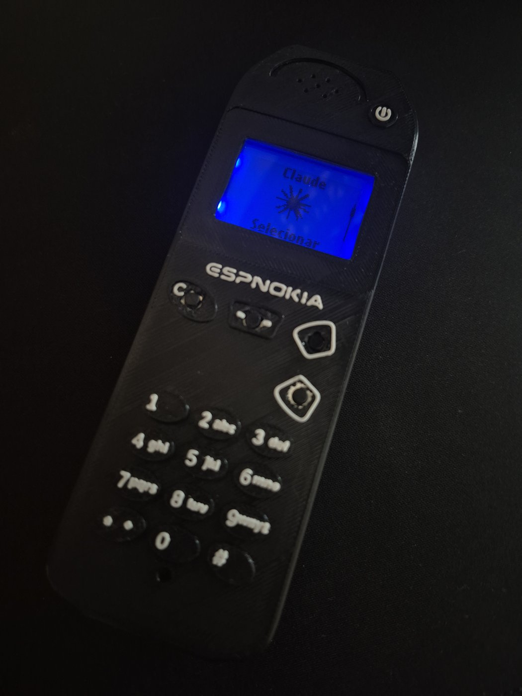
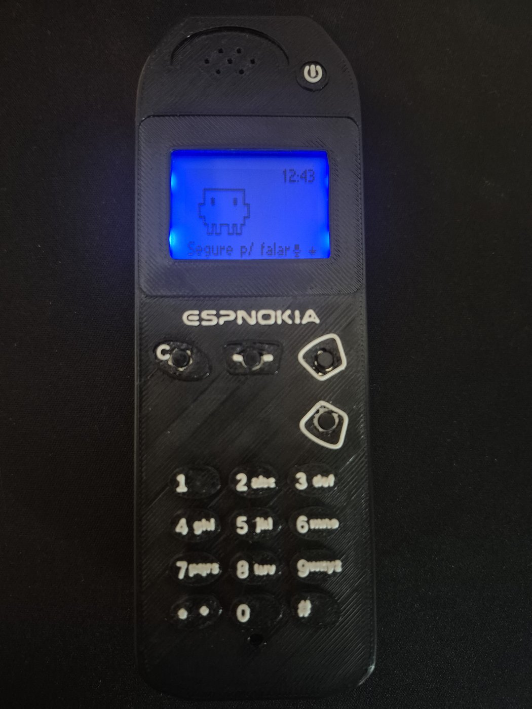
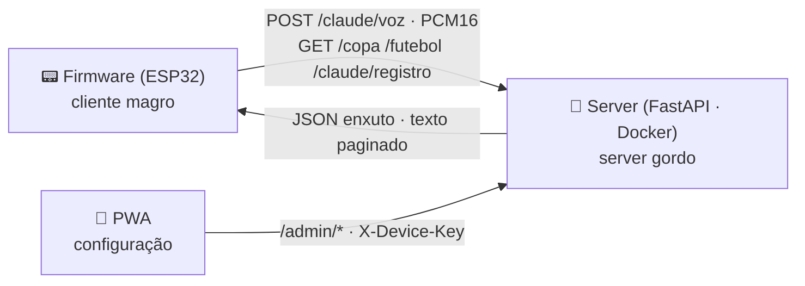

<p align="center">
  
</p>

<p align="center">
  
  
  
  
</p>

<p align="center">
  
  
  
  
</p>

<p align="center">
  <a href="README.md">🇬🇧 English</a>&nbsp;&nbsp;·&nbsp;&nbsp;🇧🇷 Português&nbsp;&nbsp;·&nbsp;&nbsp;<a href="docs/INSTALL.pt-br.md">🔧 Montar o seu</a>&nbsp;&nbsp;·&nbsp;&nbsp;<a href="docs/ARQUITETURA.md">🏛️ Arquitetura</a>&nbsp;&nbsp;·&nbsp;&nbsp;<a href="docs/MAKE_AN_APP.pt-br.md">🧩 Criar um app</a>
</p>

---

<p align="center"><b>Um Nokia 3310 que fala com o Claude — firmware, case impressa, backend e PWA, tudo feito por mim.</b></p>

Construí este handheld do zero pra reunir num só projeto tudo que eu queria mostrar: **firmware embarcado** num ESP32, uma **case que desenhei e imprimi**, um **backend FastAPI com IA** e um **PWA de configuração**. É o meu portfólio end-to-end — do pixel na tela de 84×48 ao container no deploy. Estética de 2000, recursos de 2026.

<!-- FOTO — descomentar após adicionar docs/assets/foto-espnokia-01.jpg:
<p align="center">
  
</p>
-->

<p align="center">
  
</p>

---

## ✨ O que ele faz

- 🐾 **Claw'd — falar com o Claude.** Segura o botão, fala, solta: o mic capta, o server transcreve, o **Claude responde** e um bichinho em pixel art lê a resposta na telinha. Cada troca vira **registro**, e uma **memória** acumulativa deixa o pet lembrar de você entre reboots.
- 🏆 **Copa 2026 ao vivo.** Próximos jogos, jogos do Brasil, painel ao vivo e tabelas de grupos. Marque uma partida e o aparelho **toca quando começa**; o placar se atualiza sozinho e **"GOL!" pisca na tela** no instante em que muda.
- ⚽ **Ligas de clubes.** Champions, Libertadores e cia., com tabela de classificação que **se adapta à competição** (pontos corridos numerados / grupos navegáveis).
- ⏰ **Dia a dia estilo 3310.** Relógio com **alarme que sobrevive a reboot** e timer, temperatura ambiente pelo DS3231, e **9 toques originais da Nokia** em RTTTL.
- 🐍 **Snake II.** O clássico, com engine própria testada no PC.
- 📶 **WiFi sem recompilar.** O aparelho vira access point com captive portal e senha sorteada na hora — troca de rede e URL do server sem cabo nem reflash.
- 🌍 **9 idiomas** no sistema inteiro; **99 testes nativos** de lógica pura + **157 no server**.

<table align="center">
<tr>
<td align="center" width="50%">
  <br>
  <b>🐾 Claw'd</b> — segura, fala, o Claude responde
</td>
<td align="center" width="50%">
  <br>
  <b>🏆 Copa 26</b> — ao vivo numa tela de 84×48
</td>
</tr>
</table>

<!-- FOTO — descomentar após adicionar docs/assets/foto-espnokia-02.jpg:
<p align="center">
  
</p>
-->

**Configuração pelo PWA.** Um painel web instalável (o "EspNokia Dash") **configura o aparelho**: parear/descobrir por QR, ver o **status online**, escolher a **personalidade do Claude**, o motor de transcrição e colocar a **chave de IA** — sem tela de config no próprio Nokia.

---

## 🔍 Como funciona

São **três peças** que conversam por uma API autenticada (`X-Device-Key`). O ESP32 é um chip comum, **sem PSRAM** e com pouca RAM/flash — então ele não guarda histórico nem transcreve nada: mantém só buffers fixos, uma máquina de estados e **pagina** o que precisa. Todo o estado durável (memória do pet, transcrição, chamadas ao Claude) vive no **server**, que **resume** conversas antigas pra o contexto nunca crescer sem limite.

> **A ideia central:** *cliente magro* no ESP32 (buffers fixos, byte-capped) + *server gordo* que segura e resume o histórico. Assim o firmware cabe em **~⅓ da flash e ¼ da RAM** (flash 36.1% / RAM 25.6%).



Detalhes de arquitetura e decisões técnicas → **[docs/ARQUITETURA.md](docs/ARQUITETURA.md)**

---

## 🔌 Hardware

| | Componente | Papel |
|---|---|---|
|  | **ESP32 WROOM-32** DevKit 30 pinos | Cérebro: WiFi, 2 cores, o NokiaOS inteiro |
|  | **Display Nokia 5110** (PCD8544) | 84×48 monocromático — o painel dos Nokia de verdade, via SPI |
|  | **RTC DS3231** | Hora com bateria + termômetro de bordo, via I2C |
|  | **4 botões táteis** | UP · DOWN · OK · C — navegação completa estilo 3310 |
|  | **Buzzer passivo** | Toques RTTTL, beeps e o alerta de gol (volume via PWM) |
| 🎤 | **Mic I2S INMP441** | Capta sua voz pro Claw'd |
|  | **Protoboard + jumpers** | Montagem sem solda — pinagem completa em [`docs/INSTALL.pt-br.md`](docs/INSTALL.pt-br.md) |

---

## 🚀 Rodar / build

```bash
# Firmware (PlatformIO) — a partir de firmware/
cd firmware
pio run  -e esp32dev     # compila e grava no ESP32
pio test -e native       # 99 testes de lógica pura, roda no PC

# Server (FastAPI) — a partir de server/
cd server
docker build -t espnokia .
docker run -p 8000:8000 --env-file .env espnokia   # ANTHROPIC_API_KEY é a única obrigatória
```

**Deploy:** o `Dockerfile` plano roda em qualquer host de container — está publicado no **Railway**. Depois é só abrir *Config. → Conexões* no aparelho e apontar pra URL do server (sem reflash). Guia completo de montagem em **[docs/INSTALL.pt-br.md](docs/INSTALL.pt-br.md)**.

---

## 🙏 Créditos & atribuições

Este projeto se apoia em trabalho aberto, com agradecimento:

- **Dados** — [openfootball](https://github.com/openfootball/world-cup) (dataset da Copa em domínio público) · **ESPN** (placar ao vivo e ligas via endpoints públicos; dados © ESPN / The Walt Disney Company).
- **IA & voz** — [Anthropic Claude](https://www.anthropic.com/) (o cérebro do Claw'd) · [faster-whisper](https://github.com/SYSTRAN/faster-whisper) (STT local) · [Groq](https://groq.com/) (STT na nuvem, opcional).
- **Arte & fontes** — [nokia-3310-fonts](https://git.janouch.name/p/nokia-3310-fonts) por **Premysl Janouch** · boot do Nokia 1100 e toques de fábrica reproduzidos como homenagem.
- **Bibliotecas** — [U8g2](https://github.com/olikraus/u8g2) · [ArduinoJson](https://arduinojson.org/) · [QRCode](https://github.com/ricmoo/QRCode) · [FastAPI](https://fastapi.tiangolo.com/) · [Uvicorn](https://www.uvicorn.org/) · [httpx](https://www.python-httpx.org/) · [SDK da Anthropic](https://github.com/anthropics/anthropic-sdk-python).

---

## ⚖️ Marcas & autoria

**Nokia** e os designs dos telefones Nokia são marcas da **Nokia Corporation**. **Claude** e **Anthropic** são marcas da **Anthropic, PBC**. O nome e o emblema da **Copa do Mundo FIFA** são marcas da **FIFA**. **Groq**, **ESPN** e demais nomes pertencem aos seus respectivos donos. Este é um projeto independente, **não comercial, de fã & educacional** — uma homenagem — e **não é afiliado, endossado ou patrocinado** por nenhum deles.

Código, firmware, pixel art e assets originais © 2026 **Bernardo Melo**. Componentes de terceiros mantêm suas próprias licenças.

<p align="center">
  Quer um na sua mesa? → <a href="docs/INSTALL.pt-br.md"><b>🔧 Guia de montagem</b></a>
  &nbsp;·&nbsp;  feito por <b>Bernardo Melo</b>
</p>
