<p align="center">
  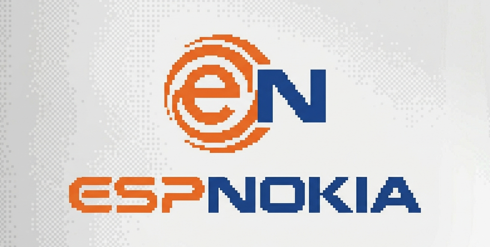
</p>

<p align="center">
  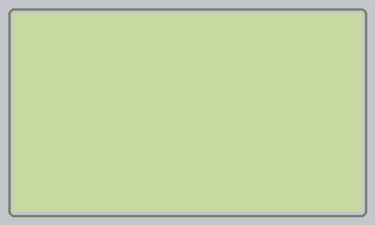
</p>

<p align="center">
  
  
  
  
</p>

<p align="center">
  <a href="#-clawd--falar-com-o-claude-num-nokia">
    
  </a>
  &nbsp;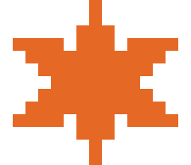
</p>

<p align="center">
  
  
  
  
</p>

<h3 align="center">
  📟 Conhecer o projeto&nbsp;&nbsp;·&nbsp;&nbsp;<a href="docs/INSTALL.pt-br.md">🔧 Montar o seu</a>
</h3>

<p align="center">
  <a href="README.md">🇬🇧 English</a>&nbsp;&nbsp;·&nbsp;&nbsp;🇧🇷 Português
</p>

---

Um "celular" estilo Nokia 3310 construído do zero: um **ESP32 + display Nokia
5110** rodando um **NokiaOS próprio** — shell de apps, as fontes pixel do Nokia
3310, aquela animação de boot ali em cima com as mãozinhas se encontrando,
toques de fábrica em RTTTL e menus em 9 idiomas.

**Estética de 2000, recursos de 2026.** Ele acompanha a **Copa 2026 ao vivo** e
avisa o gol no segundo em que sai ⚽, segue **ligas de clubes** com tabela de
classificação adaptativa, e — o número principal — deixa você **segurar um botão
e falar com o Claude** 🐾: um bichinho em pixel art que escuta, pensa e responde
ali na telinha monocromática.

### ▶️ Veja em movimento

<table align="center">
<tr>
<td align="center" width="50%">
  <br>
  <b>🐾 Claw'd</b> — segura, fala, o Claude responde
</td>
<td align="center" width="50%">
  <br>
  <b>🏆 Copa 26</b> — ao vivo numa tela de 84×48
</td>
</tr>
</table>

---

## 📑 Índice

**A vitrine**
- [Os apps](#️-os-apps) · [Dia a dia](#️-dia-a-dia) · [Copa 26](#-copa-26) · [Ligas](#-ligas) · [Claw'd](#-clawd--falar-com-o-claude-num-nokia) · [Pareamento & dashboard](#-pareamento--o-dashboard)

**Por dentro**
- [APIs com & sem chave](#-o-estudo-por-trás-apis-com-chave-e-sem-chave) · [Arquitetura do sistema](#️-arquitetura-do-sistema) · [WiFi sem recompilar](#-wifi-sem-recompilar)
- [Por trás da arte](#-por-trás-da-arte) · [Hardware](#-hardware) · [Qualidade](#-qualidade) · [Crie seu próprio app](#-crie-seu-próprio-app)
- [Créditos](#-créditos--atribuições) · [Marcas](#️-marcas--autoria)

---

## 🗺️ Os apps

Tudo vive atrás de um launcher fiel à Nokia: softkeys, beep de tecla, o `:`
piscando no standby e bips de sistema distintos pra confirmação, erro e alerta.

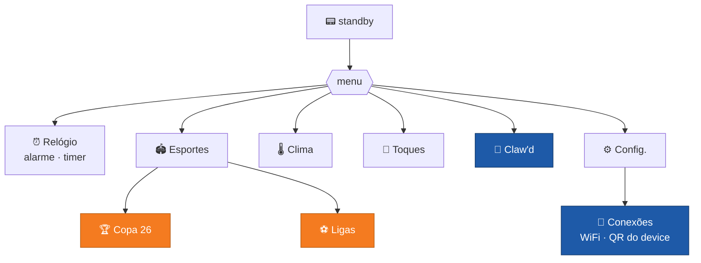
```mermaid
flowchart TD
    S["📟 standby"] --> M{{"menu"}}
    M --> CL["⏰ Relógio<br/>alarme · timer"]
    M --> SP["🏟️ Esportes"]
    M --> CW["🌡️ Clima"]
    M --> TN["🎵 Toques"]
    M --> CD["🐾 Claw'd"]
    M --> ST["⚙️ Config."]
    SP --> CP["🏆 Copa 26"]
    SP --> FB["⚽ Ligas"]
    ST --> CN["📶 Conexões<br/>WiFi · QR do device"]
    classDef hi fill:#f47b20,stroke:#b85c10,color:#fff;
    classDef bl fill:#1e5aa8,stroke:#143a6b,color:#fff;
    class CP,FB hi;
    class CD,CN bl;
```

---

# 🗂️ Vitrine

## 🛠️ Dia a dia

O arroz com feijão — um relógio estilo 3310 de verdade com **alarme** que
sobrevive a reboot e **timer**; **temperatura** ambiente pelo termômetro de bordo
do DS3231; **9 toques originais da Nokia** transcritos em RTTTL (navegue pra
ouvir, OK pra definir); e **Conexões**, onde moram o WiFi e o QR do aparelho.

<p align="center">
  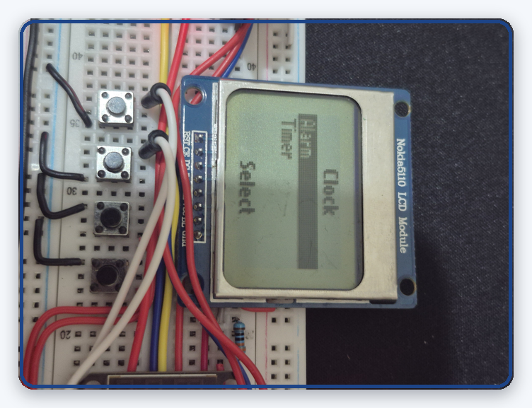
  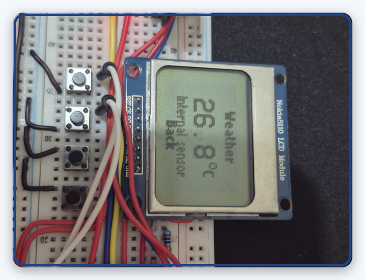
  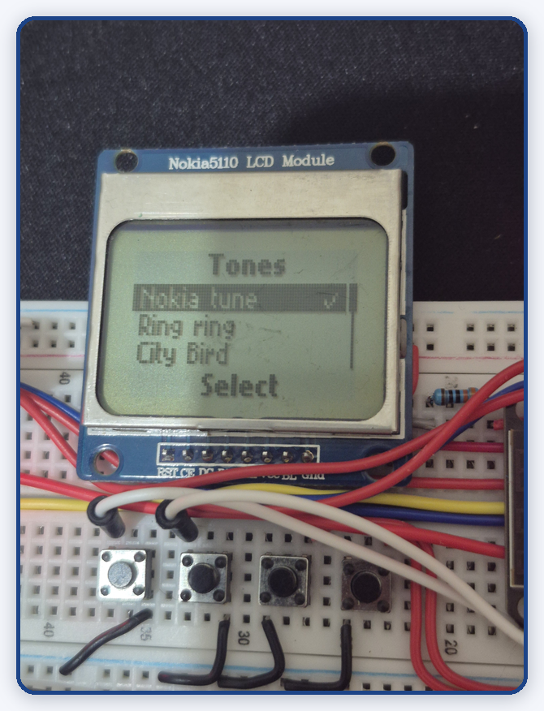
  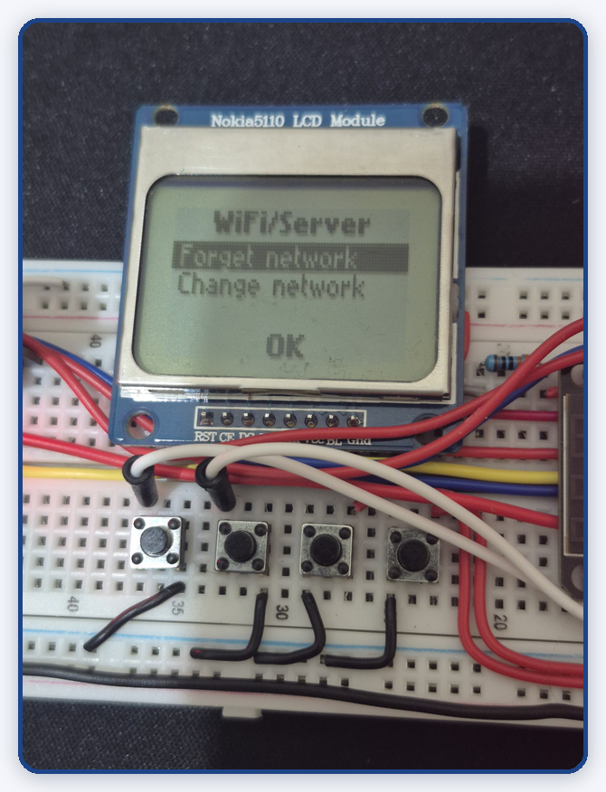
</p>

---

## 🏆 Copa 26

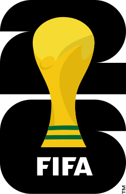

Próximos jogos, os jogos do Brasil, o painel ao vivo e as tabelas de grupos.
Marque um jogo e o aparelho **toca quando começa**; durante a partida o placar se
atualiza sozinho e **"GOL!" pisca na tela** no instante em que muda — com o nome
do autor quando a fonte tem.

<p align="center">
  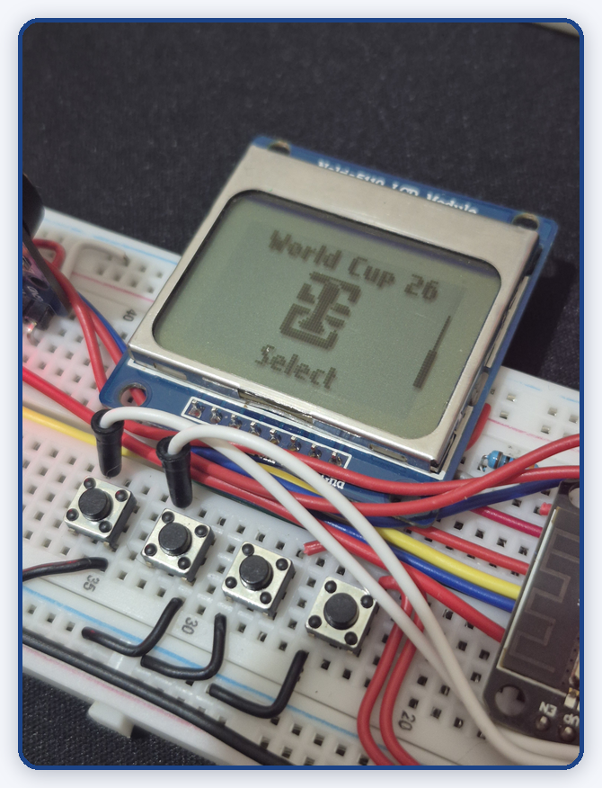
  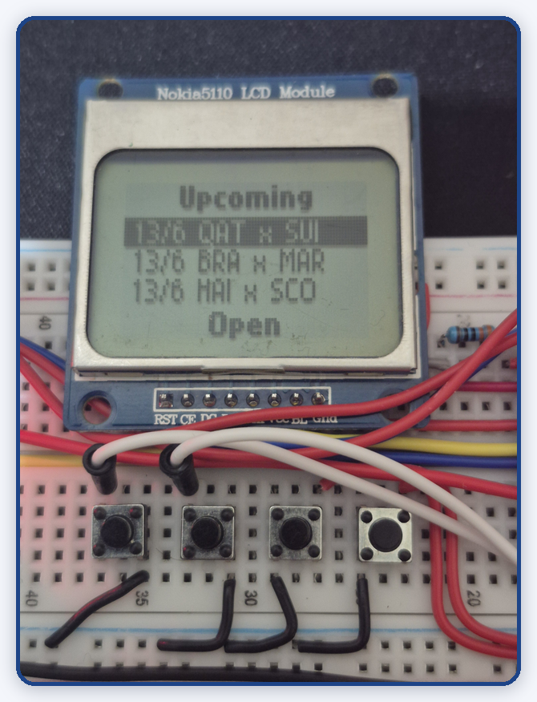
  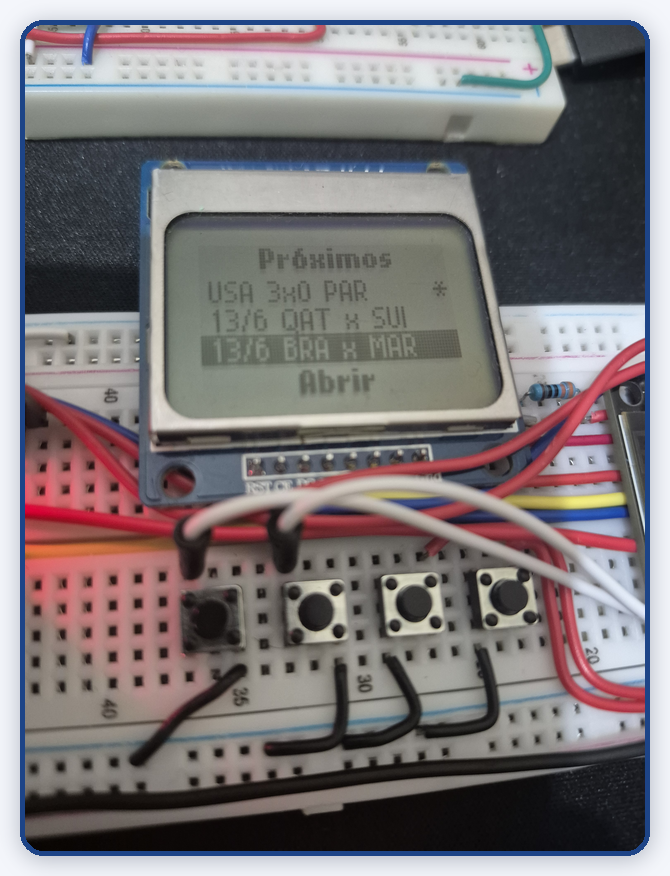
  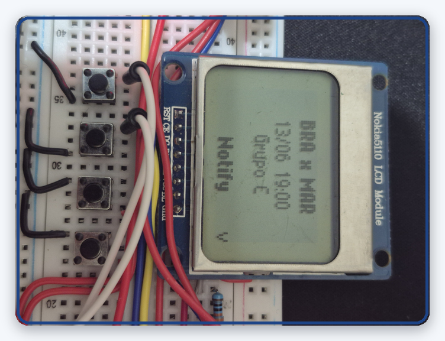
</p>

<p align="center"><b>Fluxo</b> &nbsp;·&nbsp; menu → lista ao vivo → alerta de gol</p>
<p align="center">
  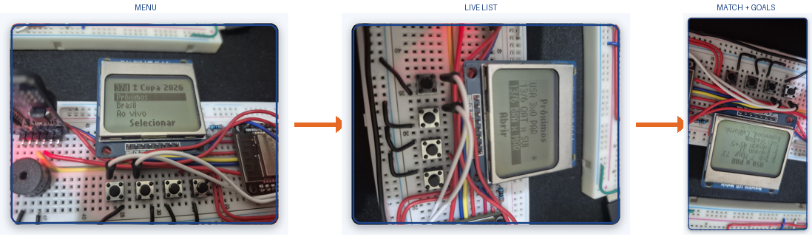
</p>

---

## ⚽ Ligas

A categoria Esportes abre também no futebol de clubes: Champions League,
Libertadores e cia. A visão de classificação **se adapta à competição** — tabela
numerada pros pontos corridos, grupos navegáveis pras copas — e o menu **captura
o que está rolando**, mostrando a temporada em jogo.

<p align="center">
  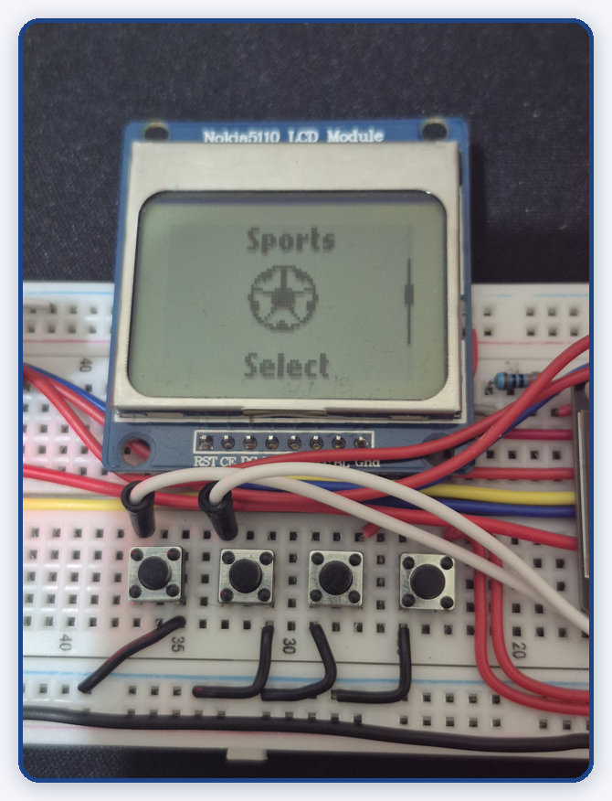
  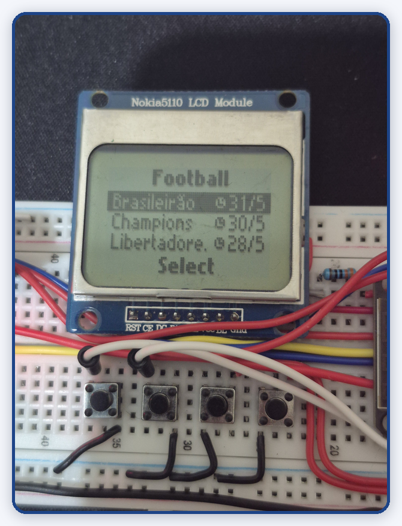
  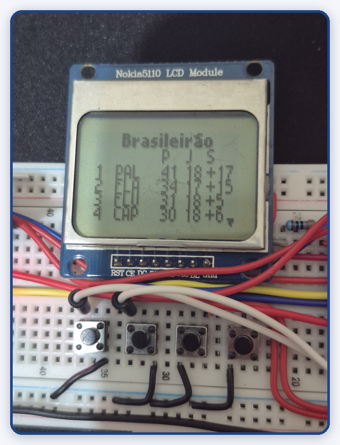
  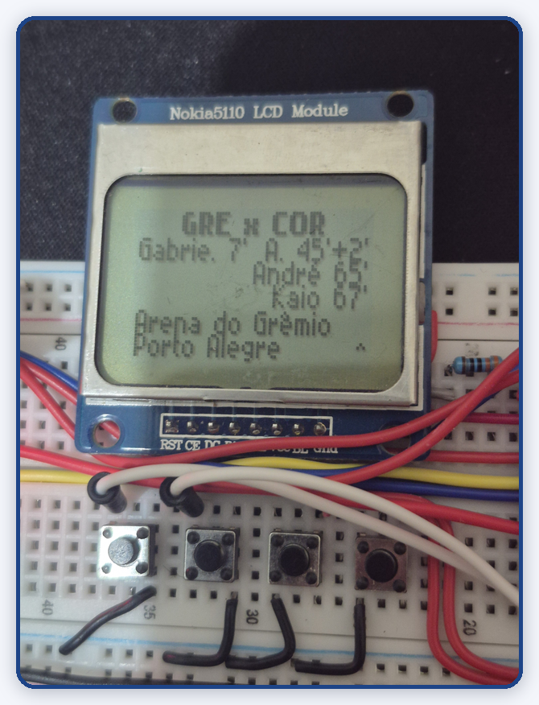
</p>

<p align="center"><b>Fluxo</b> &nbsp;·&nbsp; ligas → menu da liga → jogos / tabela</p>
<p align="center">
  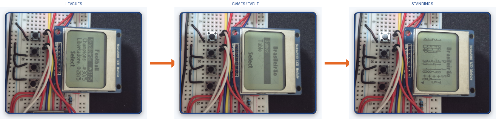
</p>

---

## 🐾 Claw'd — falar com o Claude num Nokia

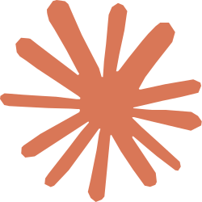

Segura o botão, **fala**, solta. O mic capta sua voz, o server companion
transcreve, o **Claude responde**, e um bichinho em pixel art lê a resposta
página por página na tela de 84×48 — pulsando a estrela de seis pontas enquanto
pensa. Cada troca fica num **registro de conversa**, e uma **memória**
acumulativa deixa o pet lembrar de você entre reboots.

<p align="center">
  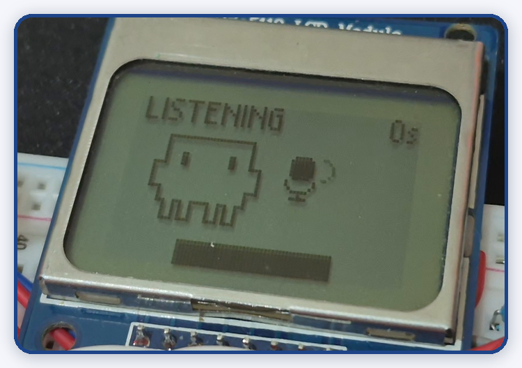
  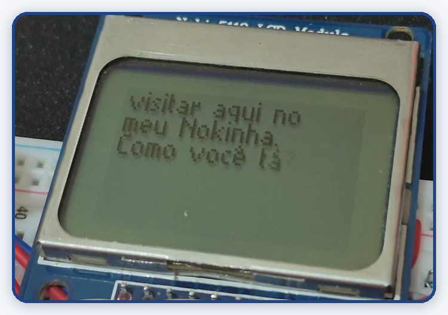
</p>

> O humor do pet reage a como você trata ele, a resposta é cortada no orçamento
> exato de bytes que a tela consegue paginar, e o spinner é a própria estrela de
> seis pontas do Claude Code, redesenhada pixel a pixel. ✶

<details open>
<summary><b>Traga suas próprias chaves</b> — o Claw'd é seu pra rodar</summary>

Não tem backend hospedado, nem conta, nada ligando pra casa. Suba o server
companion em qualquer lugar que rode container, coloque suas chaves e aponte o
aparelho pra ele:

```bash
# server/.env  (nunca versionado)
ANTHROPIC_API_KEY=sk-ant-...        # sua chave do Claude — a única obrigatória
DEVICE_KEYS=*                       # modo capability: aceita qualquer chave forte
GROQ_API_KEY=gsk_...                # opcional: STT na nuvem em vez do whisper local
```

```bash
cd server
docker build -t espnokia .
docker run -p 8000:8000 --env-file .env espnokia
```

Depois abra **Config. → Conexões** no telefone e digite a URL do seu server —
sem reflash, sem recompilar. O speech-to-text roda **localmente**
(faster-whisper) por padrão, ou troque pro **Groq** pelo dashboard se preferir.

</details>

---

## 📲 Pareamento &amp; o dashboard

<table align="center"><tr>
<td width="150" align="center">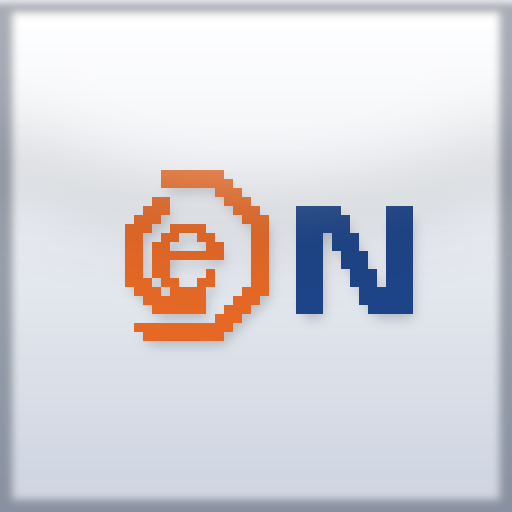</td>
<td>

O aparelho **sorteia a própria chave** no primeiro boot (RNG de hardware → NVS) e
mostra um **QR code** em *Conexões → QR do aparelho*. Escaneie e o **dashboard
abre já logado** — a chave viaja no fragmento da URL, então o navegador que
pareou é o que entra. A chave *é* a permissão: sem usuários, sem senhas, dados
isolados por device com hash salgado.

</td>
</tr></table>

O dashboard é um **PWA instalável — "EspNokia Dash"** — mobile-first, em 9
idiomas, com a paleta e o logo do telefone. Por ele você lê a **memória** do pet
e as **conversas** recentes (ou limpa), escolhe a **persona** (Fofo, Sarcástico,
Animado, Poeta, Durão, Sábio — o prompt fica no código), escolhe o **motor de
STT**, define o **limite de resposta** e coloca suas **chaves de API**.

<p align="center">
  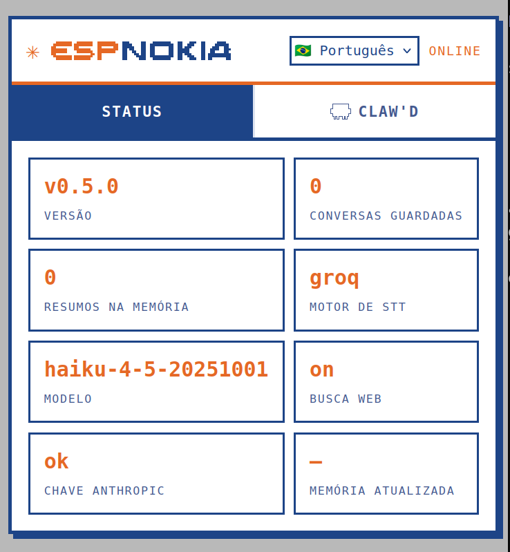
</p>

> Chave definida pelo dashboard vale enquanto o server roda; pra chave
> permanente, use a env `ANTHROPIC_API_KEY`.

<br>

---

<h1 align="center">⚙️ Por dentro</h1>

## 🔑 O estudo por trás: APIs com chave e sem chave

A espinha dorsal do projeto é um fluxo de dados completo — de uma fonte pública
na internet aberta até um display de 84×48 pixels — e as duas formas de um
aparelho ganhar acesso pelo caminho.

**API sem chave (openfootball).** Os dados da Copa vêm do
[openfootball](https://github.com/openfootball/world-cup), um dataset público em
JSON: sem cadastro, sem token. Mas API aberta não é convite pra abuso — o server
guarda cada resposta por **15 minutos** e só revalida quando o TTL vence. A fonte
de placar ao vivo é opcional e **plugável**; se ela cair, o app degrada com
elegância pra tabela em vez de quebrar.

**API com chave (o server companion).** O ESP32 nunca fala com as fontes
diretamente — ele fala com o *seu* server, que exige um **`X-Device-Key`** em
toda rota (só o `/health` fica aberto). No **modo capability** (`DEVICE_KEYS=*`)
qualquer chave forte o bastante é aceita e os dados ficam isolados por hash,
então um aparelho pode se parear sem registro central. No firmware a chave mora
na NVS (ou em `espnokia_config.h`, que é **gitignored**) — segredo não entra no
repositório.

| | fontes públicas | server companion |
|---|---|---|
| Autenticação | nenhuma | `X-Device-Key` (capability) |
| Quem consome | o server | o ESP32 |
| Resposta | JSON de centenas de KB | JSON enxuto que o chip parseia |
| O que protege | cache TTL, fallback elegante | isolamento por device, suas chaves |

## 🏛️ Arquitetura do sistema

Duas peças: o **aparelho** (firmware C++/Arduino) e um **server companion**
(FastAPI) que mastiga as fontes de dados e entrega JSON enxuto que o ESP32
consegue parsear sem sofrer. O chip nunca toca uma fonte externa diretamente — o
server é a membrana entre um buffer de 2 KB e a internet aberta.

<p align="center">
  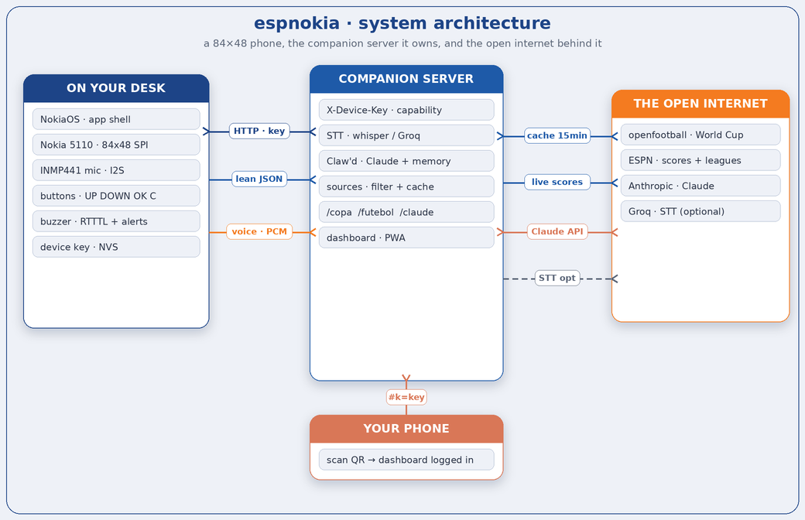
</p>

Quando você fala com o Claw'd, esta é a ida e volta — voz pra dentro, texto
paginado pra fora:

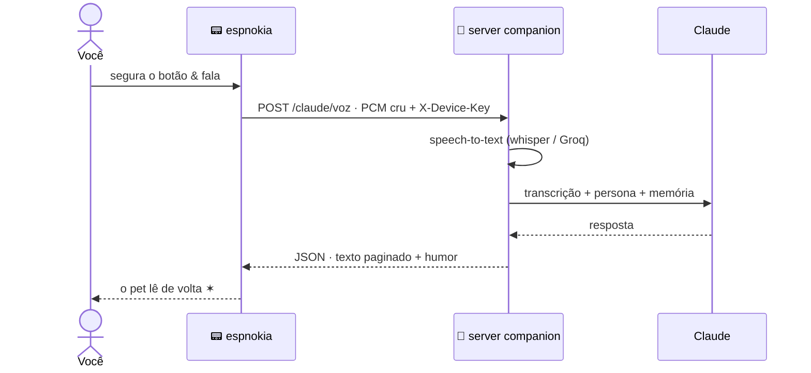
```mermaid
sequenceDiagram
    actor Você
    participant P as 📟 espnokia
    participant S as 🐍 server companion
    participant C as Claude
    Você->>P: segura o botão & fala
    P->>S: POST /claude/voz · PCM cru + X-Device-Key
    S->>S: speech-to-text (whisper / Groq)
    S->>C: transcrição + persona + memória
    C-->>S: resposta
    S-->>P: JSON · texto paginado + humor
    P-->>Você: o pet lê de volta ✶
```

## 📶 WiFi sem recompilar

Trocar de rede não pede cabo USB nem reflash. O aparelho sobe um **modo config**:
vira um access point (`espnokia-XXXX`) com **senha numérica sorteada na hora**
(RNG de hardware, exibida só na telinha) e um **captive portal** que abre
sozinho. Ele **busca as redes próximas** — cadeado nas protegidas, barras de
sinal — ou você digita um SSID **oculto** na mão. É na mesma página que você
define a **URL do server**.

<p align="center">
  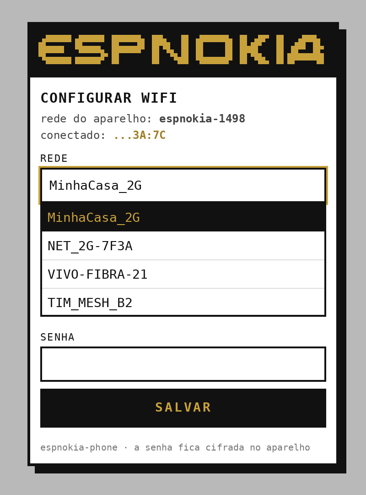
  &nbsp;&nbsp;
  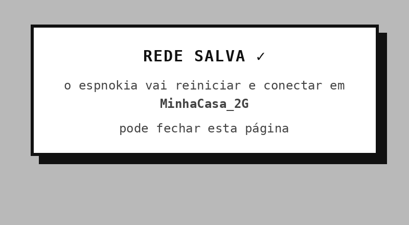
</p>

A senha da sua rede é cifrada na NVS com chave derivada do MAC gravado no eFuse
do próprio chip: um dump da flash de outro aparelho não decifra a sua. 🔐

## 🎨 Por trás da arte

Cada glifo naquela tela foi uma decisão. As **fontes pixel do Nokia 3310** são as
de verdade, redesenhadas pixel a pixel da tela por
[Premysl Janouch](https://git.janouch.name/p/nokia-3310-fonts) e convertidas pro
formato embarcado com o `bdfconv` do u8g2 — eu as estendi com os acentos Latin-1
que os 9 idiomas do sistema precisam. O boot lá em cima é o das mãozinhas do
Nokia 1100 se encontrando, quadro a quadro; o troféu da Copa, a bola, os ícones
do menu e o pet são **bitmaps escritos num pequeno DSL de grade** e compilados
pra XBM por uma [ferramenta própria](tools/) — então a arte vive no controle de
versão como texto, não como blob binário.

A parte mais difícil foi o **spinner do pensando**: fazer a estrela de seis
pontas do Claude Code ficar legível em um punhado de pixels levou várias
tentativas — renderizar grande e reduzir perdia as pontas, desenhar pequeno
distorcia, até um sprite simétrico colocado na mão finalmente pulsar certo. A
estrela laranja de seis pontas abaixo é a marca de maker que saiu disso.

<p align="center">
  
</p>

<p align="center"><b>Navegação do aparelho inteiro</b></p>
<p align="center">
  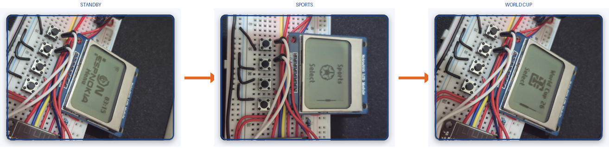
</p>

## 🔌 Hardware

| | Componente | Papel |
|---|---|---|
| 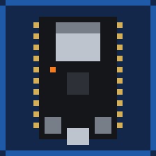 | **ESP32 WROOM-32** DevKit 30 pinos | Cérebro: WiFi, 2 cores, o NokiaOS inteiro |
| 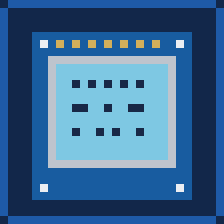 | **Display Nokia 5110** (PCD8544) | 84×48 monocromático — o painel dos Nokia de verdade, via SPI |
| 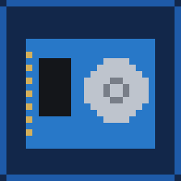 | **RTC DS3231** | Hora com bateria + termômetro de bordo, via I2C |
| 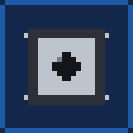 | **4 botões táteis** | UP · DOWN · OK · C — navegação completa estilo 3310 |
| 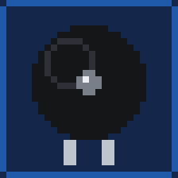 | **Buzzer passivo** | Toques RTTTL, beeps e o alerta de gol (volume via PWM) |
| 🎤 | **Mic I2S INMP441** | Capta sua voz pro Claw'd |
| 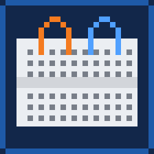 | **Protoboard + jumpers** | Montagem sem solda — pinagem completa em [`docs/INSTALL.pt-br.md`](docs/INSTALL.pt-br.md) |

<p align="center">
  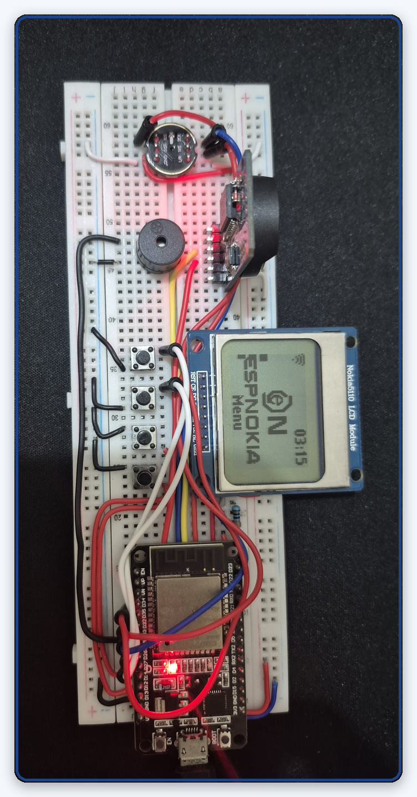
</p>

## 🧪 Qualidade

- **82 testes Unity** rodando direto no PC (`pio test -e native`) — toda a lógica
  pura (shell, botões, RTTTL, formatação de hora, parse da Copa e do futebol, o
  modelo do Claw'd, i18n) testa sem placa nenhuma na mesa.
- **157 testes pytest** no server — fontes mockadas, auth, cache, personas,
  memória e os endpoints do dashboard.
- Camadas bem separadas: `drivers/` (hardware) · `lib/` (lógica pura portável) ·
  `apps/` (UI). Essa separação é o que permite testar no PC o que roda no ESP32.

E cabe tudo com folga — o NokiaOS inteiro, os apps, WiFi/TLS e o pipeline de voz
ocupam **um terço da flash** e um quarto da RAM:

<p align="center">
  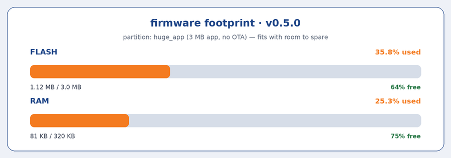
</p>

```
firmware/   NokiaOS em C++/Arduino (PlatformIO: esp32dev + native)
  lib/      lógica pura testável: shell, btnlogic, rtttl, i18n, copamodel, claudemodel...
  src/      drivers, apps, som, alarme, rede (wifi/http/ntp/provisionamento), conn
server/     companion FastAPI: /copa /futebol /claude /admin + o dashboard PWA
docs/       instalação, assets do README
tools/      utilitários de pixel art (grid → XBM)
```

## 🧩 Crie seu próprio app

O NokiaOS é um app shell — uma tela nova é uma struct pequena de callbacks mais
uma linha no launcher. Tem um **direcionamento passo a passo** pra isso (uma
sugestão, não uma regra), com um app mínimo pra você copiar:

<p align="center">
  <b><a href="docs/MAKE_AN_APP.pt-br.md">🧩 Crie seu próprio app →</a></b>
</p>

---

## 🙏 Créditos &amp; atribuições

Este projeto se apoia em trabalho aberto. Cada fonte externa, biblioteca e
referência em que ele se apoia, com agradecimento:

**Fontes de dados**
- [**openfootball**](https://github.com/openfootball/world-cup) — dataset da Copa em domínio público (jogos &amp; tabelas).
- **ESPN** — placar ao vivo e dados de ligas via endpoints públicos não oficiais. Placares e dados dos times © ESPN / The Walt Disney Company.

**IA &amp; voz**
- [**Anthropic Claude**](https://www.anthropic.com/) — o cérebro do Claw'd, via API da Anthropic.
- [**faster-whisper**](https://github.com/SYSTRAN/faster-whisper) — speech-to-text local (CTranslate2 / OpenAI Whisper).
- [**Groq**](https://groq.com/) — speech-to-text na nuvem (opcional).

**Fontes tipográficas &amp; referência de arte**
- [**nokia-3310-fonts**](https://git.janouch.name/p/nokia-3310-fonts) por **Premysl Janouch** — as fontes pixel do Nokia 3310, o coração do visual da UI.
- Sequência de boot do Nokia 1100 &amp; toques de fábrica — reproduzidos da referência como homenagem.

**Bibliotecas do firmware**
- [**U8g2**](https://github.com/olikraus/u8g2) (olikraus) · [**ArduinoJson**](https://arduinojson.org/) (bblanchon) · [**QRCode**](https://github.com/ricmoo/QRCode) (ricmoo).

**Bibliotecas do server**
- [**FastAPI**](https://fastapi.tiangolo.com/) · [**Uvicorn**](https://www.uvicorn.org/) · [**httpx**](https://www.python-httpx.org/) · o [**SDK da Anthropic**](https://github.com/anthropics/anthropic-sdk-python).

**Logos** — o símbolo do Claude e o emblema da Copa do Mundo FIFA 2026 mostrados acima são reproduzidos do [Wikimedia Commons](https://commons.wikimedia.org/) apenas para referência.

---

## ⚖️ Marcas &amp; autoria

**Nokia** e os designs dos telefones Nokia são marcas da **Nokia Corporation**.
**Claude** e **Anthropic** são marcas da **Anthropic, PBC**. O nome e o emblema
da **Copa do Mundo FIFA** são marcas da **FIFA**. **Groq**, **ESPN** e quaisquer
outros nomes pertencem aos seus respectivos donos. Este é um projeto
independente, **não comercial, de fã &amp; educacional** — uma homenagem — e
**não é afiliado, endossado ou patrocinado** por nenhum deles. Todas as marcas,
logos e dados referenciados continuam propriedade dos seus respectivos donos.

Código, firmware, pixel art e assets originais © 2026 **Bernardo Melo**.
Componentes de terceiros mantêm suas próprias licenças (veja cada projeto acima).

---

<p align="center">
  Quer um na sua mesa? → <a href="docs/INSTALL.pt-br.md"><b>🔧 Guia de montagem e instalação</b></a>
  &nbsp;·&nbsp;  feito por <b>Bernardo Melo</b>
</p>
